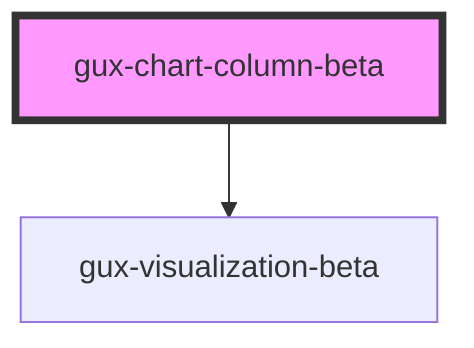

# gux-chart-column-beta

<!-- Auto Generated Below -->

## Properties

| Property          | Attribute            | Description                                                                                                                                                                                                              | Type                                                                                                               | Default                                       |
| ----------------- | -------------------- | ------------------------------------------------------------------------------------------------------------------------------------------------------------------------------------------------------------------------ | ------------------------------------------------------------------------------------------------------------------ | --------------------------------------------- |
| `chartData`       | --                   | Data to be rendered in the chart. Data field names must match the values you set in xFieldName and yFieldName                                                                                                            | `{ [x: string]: any; }`                                                                                            | `undefined`                                   |
| `chartLayers`     | --                   | List specifying the order of optional chart layers. For correct chart layering, each chartData entry must also include a "series" field with a value indicating which layer the entry belongs to, e.g 'series': 'group1' | `string[]`                                                                                                         | `undefined`                                   |
| `domainColor`     | `domain-color`       | Optional domain line color                                                                                                                                                                                               | `string`                                                                                                           | `VisualizationColorUtil.DEFAULT_DOMAIN_COLOR` |
| `embedOptions`    | --                   |                                                                                                                                                                                                                          | `EmbedOptions<string, Renderers>`                                                                                  | `undefined`                                   |
| `includeLegend`   | `include-legend`     |                                                                                                                                                                                                                          | `boolean`                                                                                                          | `undefined`                                   |
| `labelColor`      | `label-color`        | Optional label color                                                                                                                                                                                                     | `string`                                                                                                           | `VisualizationColorUtil.DEFAULT_LABEL_COLOR`  |
| `legendPosition`  | `legend-position`    |                                                                                                                                                                                                                          | `"bottom" \| "bottom-left" \| "bottom-right" \| "left" \| "none" \| "right" \| "top" \| "top-left" \| "top-right"` | `'right'`                                     |
| `legendTitle`     | `legend-title`       | Title to display above the optional legend                                                                                                                                                                               | `string`                                                                                                           | `undefined`                                   |
| `xAxisTitle`      | `x-axis-title`       | Title to display along the x-axis                                                                                                                                                                                        | `string`                                                                                                           | `undefined`                                   |
| `xFieldName`      | `x-field-name`       | Name for the data field to use to populate the chart's x-axis e.g. xFieldName of "category" will map any "category" fields in chartData to the x-axis                                                                    | `string`                                                                                                           | `undefined`                                   |
| `xTickLabelSlant` | `x-tick-label-slant` | If true, then make Axis tick label 45 degrees                                                                                                                                                                            | `boolean`                                                                                                          | `undefined`                                   |
| `yAxisTitle`      | `y-axis-title`       | Title to display along the y-axis                                                                                                                                                                                        | `string`                                                                                                           | `undefined`                                   |
| `yFieldName`      | `y-field-name`       | Name for the data field to use to populate the chart's x-axis e.g. yFieldName of "value" will map any "value" fields in chartData to the y-axis                                                                          | `string`                                                                                                           | `undefined`                                   |

## Dependencies

### Depends on

- [gux-visualization-beta](../gux-visualization)

### Graph

----------------------------------------------

*Built with [StencilJS](https://stenciljs.com/)*
