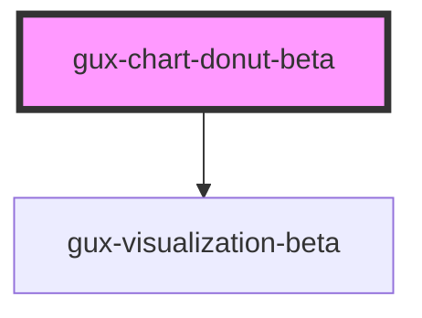

# gux-chart-donut-beta

<!-- Auto Generated Below -->

## Properties

| Property           | Attribute            | Description                                                                                                   | Type                                                                                                               | Default     |
| ------------------ | -------------------- | ------------------------------------------------------------------------------------------------------------- | ------------------------------------------------------------------------------------------------------------------ | ----------- |
| `centerSubText`    | `center-sub-text`    |                                                                                                               | `string`                                                                                                           | `undefined` |
| `centerText`       | `center-text`        |                                                                                                               | `string`                                                                                                           | `undefined` |
| `chartData`        | `chart-data`         | Data to be rendered in the chart. Data field names must match the values you set in xFieldName and yFieldName | `{ [x: string]: any; }`                                                                                            | `undefined` |
| `colorFieldName`   | `color-field-name`   |                                                                                                               | `string`                                                                                                           | `undefined` |
| `embedOptions`     | `embed-options`      |                                                                                                               | `EmbedOptions`                                                                                                     | `undefined` |
| `gauge`            | `gauge`              |                                                                                                               | `boolean`                                                                                                          | `undefined` |
| `includeLegend`    | `include-legend`     |                                                                                                               | `boolean`                                                                                                          | `undefined` |
| `innerRadius`      | `inner-radius`       |                                                                                                               | `number`                                                                                                           | `undefined` |
| `labelField`       | `label-field`        |                                                                                                               | `string`                                                                                                           | `undefined` |
| `labelRadius`      | `label-radius`       |                                                                                                               | `number`                                                                                                           | `undefined` |
| `legendFontSize`   | `legend-font-size`   |                                                                                                               | `number`                                                                                                           | `undefined` |
| `legendPosition`   | `legend-position`    |                                                                                                               | `"bottom" \| "bottom-left" \| "bottom-right" \| "left" \| "none" \| "right" \| "top" \| "top-left" \| "top-right"` | `'right'`   |
| `legendSymbolSize` | `legend-symbol-size` |                                                                                                               | `number`                                                                                                           | `undefined` |
| `legendTitle`      | `legend-title`       |                                                                                                               | `string`                                                                                                           | `undefined` |
| `legendX`          | `legend-x`           |                                                                                                               | `number`                                                                                                           | `undefined` |
| `legendY`          | `legend-y`           |                                                                                                               | `number`                                                                                                           | `undefined` |
| `outerRadius`      | `outer-radius`       |                                                                                                               | `number`                                                                                                           | `undefined` |
| `showTooltip`      | `show-tooltip`       |                                                                                                               | `boolean`                                                                                                          | `true`      |
| `tooltipOptions`   | `tooltip-options`    |                                                                                                               | `EmbedOptions`                                                                                                     | `undefined` |

## Dependencies

### Depends on

- [gux-visualization-beta](../gux-visualization)

### Graph

----------------------------------------------

*Built with [StencilJS](https://stenciljs.com/)*
