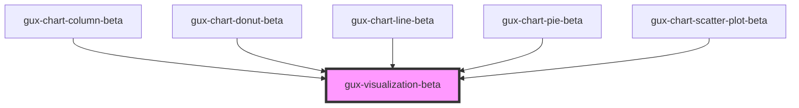

# gux-visualization-beta

<!-- Auto Generated Below -->

## Properties

| Property            | Attribute            | Description | Type                | Default     |
| ------------------- | -------------------- | ----------- | ------------------- | ----------- |
| `embedOptions`      | `embed-options`      |             | `EmbedOptions`      | `undefined` |
| `visualizationSpec` | `visualization-spec` |             | `VisualizationSpec` | `undefined` |

## Events

| Event                 | Description | Type               |
| --------------------- | ----------- | ------------------ |
| `chartClicked`        |             | `CustomEvent<any>` |
| `chartComponentReady` |             | `CustomEvent<any>` |

## Dependencies

### Used by

 - [gux-chart-column-beta](../gux-chart-column)
 - [gux-chart-donut-beta](../gux-chart-donut)
 - [gux-chart-line-beta](../gux-chart-line)
 - [gux-chart-pie-beta](../gux-chart-pie)
 - [gux-chart-scatter-plot-beta](../gux-chart-scatter-plot)

### Graph

----------------------------------------------

*Built with [StencilJS](https://stenciljs.com/)*
