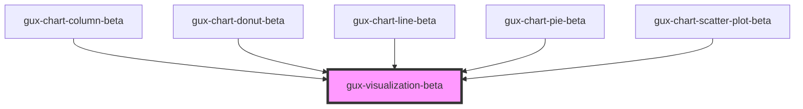

# gux-visualization-beta

<!-- Auto Generated Below -->

## Properties

| Property                  | Attribute                  | Description | Type                                                                                                                                                                                                                                                                                                                                                                                                                                                                                                                                                                                                                                                                                                                                                                                                                                                                                                                                                                                                                                                                                                                                                                                                                                                                                                                                                                                                                                                                                                                                                                                                                                                                                                                                  | Default     |
| ------------------------- | -------------------------- | ----------- | ------------------------------------------------------------------------------------------------------------------------------------------------------------------------------------------------------------------------------------------------------------------------------------------------------------------------------------------------------------------------------------------------------------------------------------------------------------------------------------------------------------------------------------------------------------------------------------------------------------------------------------------------------------------------------------------------------------------------------------------------------------------------------------------------------------------------------------------------------------------------------------------------------------------------------------------------------------------------------------------------------------------------------------------------------------------------------------------------------------------------------------------------------------------------------------------------------------------------------------------------------------------------------------------------------------------------------------------------------------------------------------------------------------------------------------------------------------------------------------------------------------------------------------------------------------------------------------------------------------------------------------------------------------------------------------------------------------------------------------- | ----------- |
| `embedOptions`            | `embed-options`            |             | `EmbedOptions<string, Renderers>`                                                                                                                                                                                                                                                                                                                                                                                                                                                                                                                                                                                                                                                                                                                                                                                                                                                                                                                                                                                                                                                                                                                                                                                                                                                                                                                                                                                                                                                                                                                                                                                                                                                                                                     | `undefined` |
| `screenreaderDescription` | `screenreader-description` |             | `string`                                                                                                                                                                                                                                                                                                                                                                                                                                                                                                                                                                                                                                                                                                                                                                                                                                                                                                                                                                                                                                                                                                                                                                                                                                                                                                                                                                                                                                                                                                                                                                                                                                                                                                                              | `undefined` |
| `visualizationSpec`       | `visualization-spec`       |             | `GenericConcatSpec<NonNormalizedSpec> & TopLevelProperties<ExprRef \| SignalRef> & { $schema?: string; config?: Config<ExprRef \| SignalRef>; datasets?: Datasets; usermeta?: Dict<unknown>; } \| GenericFacetSpec<UnitSpecWithFrame<Field>, LayerSpec<Field>, Field> & TopLevelProperties<ExprRef \| SignalRef> & { $schema?: string; config?: Config<ExprRef \| SignalRef>; datasets?: Datasets; usermeta?: Dict<unknown>; } & DataMixins \| GenericHConcatSpec<NonNormalizedSpec> & TopLevelProperties<ExprRef \| SignalRef> & { $schema?: string; config?: Config<ExprRef \| SignalRef>; datasets?: Datasets; usermeta?: Dict<unknown>; } \| GenericUnitSpec<FacetedCompositeEncoding<Field>, AnyMark, TopLevelParameter> & ResolveMixins & GenericCompositionLayout & FrameMixins<ExprRef \| SignalRef> & TopLevelProperties<ExprRef \| SignalRef> & { $schema?: string; config?: Config<ExprRef \| SignalRef>; datasets?: Datasets; usermeta?: Dict<unknown>; } & DataMixins \| GenericVConcatSpec<NonNormalizedSpec> & TopLevelProperties<ExprRef \| SignalRef> & { $schema?: string; config?: Config<ExprRef \| SignalRef>; datasets?: Datasets; usermeta?: Dict<unknown>; } \| LayerRepeatSpec & TopLevelProperties<ExprRef \| SignalRef> & { $schema?: string; config?: Config<ExprRef \| SignalRef>; datasets?: Datasets; usermeta?: Dict<unknown>; } \| LayerSpec<Field> & TopLevelProperties<ExprRef \| SignalRef> & { $schema?: string; config?: Config<ExprRef \| SignalRef>; datasets?: Datasets; usermeta?: Dict<unknown>; } \| NonLayerRepeatSpec & TopLevelProperties<ExprRef \| SignalRef> & { $schema?: string; config?: Config<ExprRef \| SignalRef>; datasets?: Datasets; usermeta?: Dict<unknown>; } \| Spec` | `undefined` |

## Events

| Event                 | Description | Type               |
| --------------------- | ----------- | ------------------ |
| `chartClicked`        |             | `CustomEvent<any>` |
| `chartComponentReady` |             | `CustomEvent<any>` |

## Dependencies

### Used by

 - [gux-chart-column-beta](../gux-chart-column)
 - [gux-chart-donut-beta](../gux-chart-donut)
 - [gux-chart-line-beta](../gux-chart-line)
 - [gux-chart-pie-beta](../gux-chart-pie)
 - [gux-chart-scatter-plot-beta](../gux-chart-scatter-plot)

### Graph

----------------------------------------------

*Built with [StencilJS](https://stenciljs.com/)*
