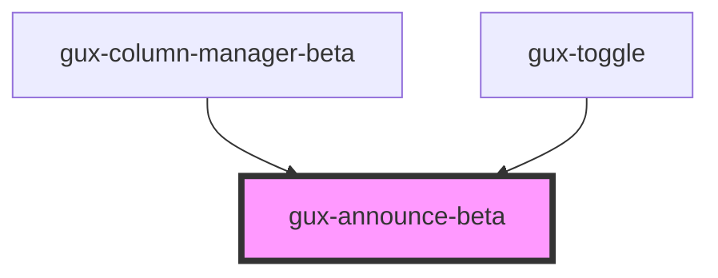

# gux-announce-beta
<!-- Auto Generated Below -->

## Properties

| Property     | Attribute    | Description | Type                               | Default    |
| ------------ | ------------ | ----------- | ---------------------------------- | ---------- |
| `politeness` | `politeness` |             | `"assertive" \| "off" \| "polite"` | `'polite'` |

## Methods

### `guxAnnounce(text: string) => Promise<void>`

#### Returns

Type: `Promise<void>`

## Slots

| Slot | Description |
| ---- | ----------- |
|      | element     |

## Dependencies

### Used by

 - [gux-column-manager-beta](../gux-column-manager)
 - [gux-toggle](../../stable/gux-toggle)

### Graph

----------------------------------------------

*Built with [StencilJS](https://stenciljs.com/)*
