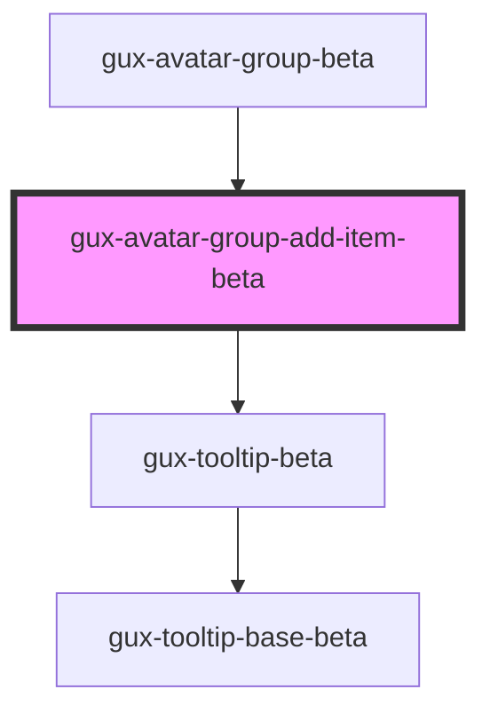

# gux-avatar-group-add-item-beta

<!-- Auto Generated Below -->

## Methods

### `hideTooltip() => Promise<void>`

#### Returns

Type: `Promise<void>`

## Dependencies

### Used by

 - [gux-avatar-group-beta](..)

### Depends on

- [gux-tooltip-beta](../../gux-tooltip-beta)

### Graph

----------------------------------------------

*Built with [StencilJS](https://stenciljs.com/)*
