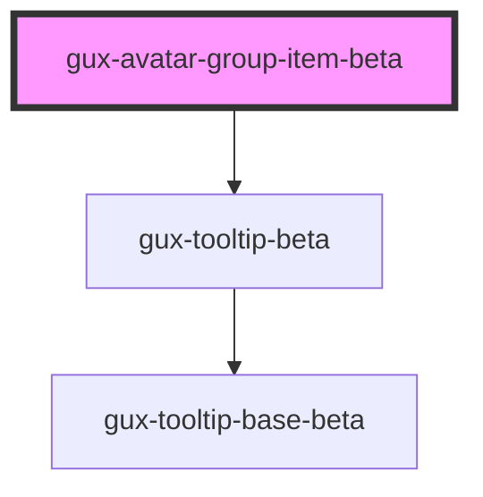

# gux-avatar-group-item-beta

<!-- Auto Generated Below -->

## Properties

| Property | Attribute | Description                                                                                                                                                            | Type                                                                                                                             | Default     |
| -------- | --------- | ---------------------------------------------------------------------------------------------------------------------------------------------------------------------- | -------------------------------------------------------------------------------------------------------------------------------- | ----------- |
| `accent` | `accent`  | Manually sets avatar accent                                                                                                                                            | `"0" \| "1" \| "10" \| "11" \| "12" \| "2" \| "3" \| "4" \| "5" \| "6" \| "7" \| "8" \| "9" \| "auto" \| "default" \| "inherit"` | `'auto'`    |
| `name`   | `name`    | Name which is shown as initials. Should be formatted 'Lastname Firstname' for JA, zhCN and KO names. Names without blank space will show first 2 characters of string. | `string`                                                                                                                         | `undefined` |

## Methods

### `guxFocus() => Promise<void>`

#### Returns

Type: `Promise<void>`

### `hideTooltip() => Promise<void>`

#### Returns

Type: `Promise<void>`

## Slots

| Slot      | Description   |
| --------- | ------------- |
| `"image"` | Avatar photo. |

## Dependencies

### Depends on

- [gux-tooltip-beta](../../gux-tooltip-beta)

### Graph

----------------------------------------------

*Built with [StencilJS](https://stenciljs.com/)*
