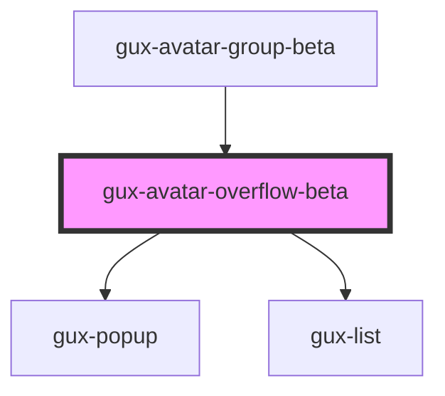

# gux-avatar-overflow-beta

<!-- Auto Generated Below -->

## Properties

| Property | Attribute | Description | Type     | Default |
| -------- | --------- | ----------- | -------- | ------- |
| `count`  | `count`   |             | `number` | `0`     |

## Methods

### `guxFocus() => Promise<void>`

#### Returns

Type: `Promise<void>`

## Slots

| Slot | Description                                       |
| ---- | ------------------------------------------------- |
|      | Some list items with gux-avatar-focusable in them |

## Dependencies

### Used by

 - [gux-avatar-group-beta](..)

### Depends on

- [gux-popup](../../../stable/gux-popup)
- [gux-list](../../../stable/gux-list)

### Graph

----------------------------------------------

*Built with [StencilJS](https://stenciljs.com/)*
