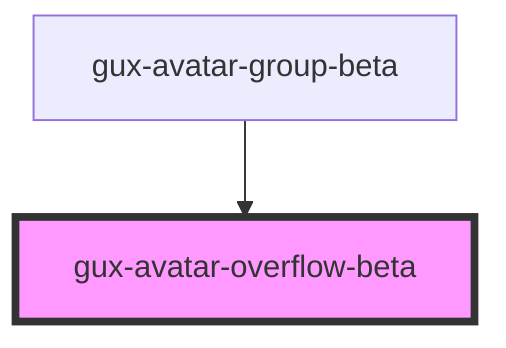

# gux-avatar-overflow-beta

<!-- Auto Generated Below -->

## Methods

### `guxClose() => Promise<void>`

#### Returns

Type: `Promise<void>`

## Slots

| Slot | Description                           |
| ---- | ------------------------------------- |
|      | a number of gux-avatar-overflow-items |

## Dependencies

### Used by

 - [gux-avatar-group-beta](..)

### Graph

----------------------------------------------

*Built with [StencilJS](https://stenciljs.com/)*
