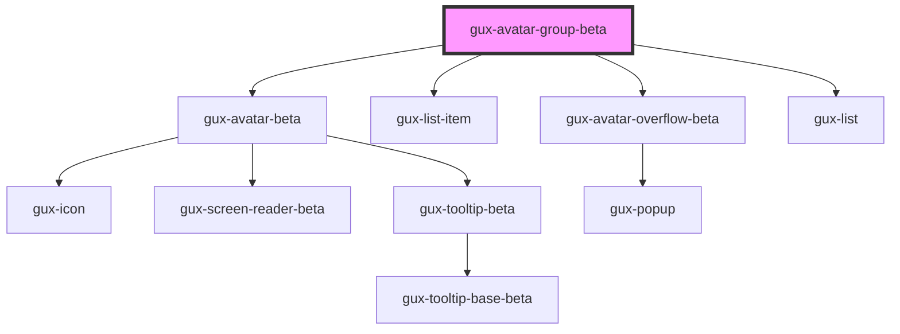

# gux-avatar-group-beta

<!-- Auto Generated Below -->

## Properties

| Property      | Attribute      | Description | Type     | Default |
| ------------- | -------------- | ----------- | -------- | ------- |
| `avatarLimit` | `avatar-limit` |             | `number` | `7`     |

## Dependencies

### Depends on

- [gux-avatar-beta](../gux-avatar)
- [gux-list-item](../../stable/gux-list/gux-list-item)
- [gux-avatar-overflow-beta](gux-avatar-overflow)
- [gux-list](../../stable/gux-list)

### Graph

----------------------------------------------

*Built with [StencilJS](https://stenciljs.com/)*
