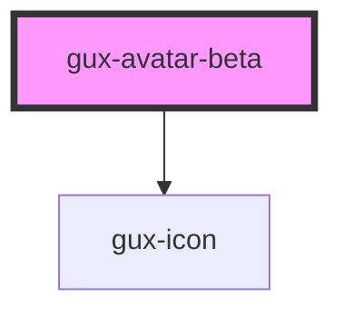

# gux-avatar-beta

<!-- Auto Generated Below -->

## Properties

| Property            | Attribute        | Description                                                | Type                                                                                             | Default       |
| ------------------- | ---------------- | ---------------------------------------------------------- | ------------------------------------------------------------------------------------------------ | ------------- |
| `accent`            | `accent`         |                                                            | `"auto" \| "default" \| 1 \| 10 \| 11 \| 12 \| 2 \| 3 \| 4 \| 5 \| 6 \| 7 \| 8 \| 9`             | `'default'`   |
| `hasBadge`          | `has-badge`      | Shows a status badge                                       | `boolean`                                                                                        | `false`       |
| `isInteractive`     | `is-interactive` | Wrap the content with a button if it needs to be clickable | `boolean`                                                                                        | `false`       |
| `name` _(required)_ | `name`           |                                                            | `string`                                                                                         | `undefined`   |
| `notifications`     | `notifications`  | Override the status badge with a notification icon         | `boolean`                                                                                        | `false`       |
| `size`              | `size`           |                                                            | `"large" \| "medium" \| "small" \| "xsmall"`                                                     | `'large'`     |
| `status`            | `status`         |                                                            | `"available" \| "break" \| "busy" \| "notifications" \| "offline" \| "out-of-office" \| "queue"` | `'available'` |
| `statusRing`        | `status-ring`    | Shows a status ring around the avatar                      | `boolean`                                                                                        | `false`       |

## Slots

| Slot      | Description     |
| --------- | --------------- |
| `"image"` | Headshot photo. |

## Dependencies

### Depends on

- [gux-icon](../../stable/gux-icon)

### Graph

----------------------------------------------

*Built with [StencilJS](https://stenciljs.com/)*
