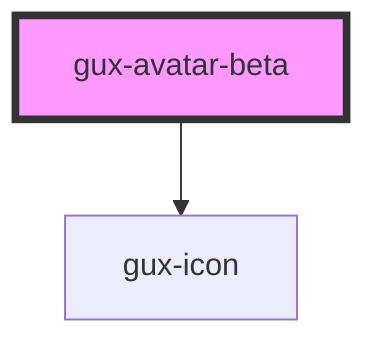

# gux-avatar-beta

<!-- Auto Generated Below -->

## Properties

| Property            | Attribute        | Description                                                                                                                                                            | Type                                                                                                                             | Default       |
| ------------------- | ---------------- | ---------------------------------------------------------------------------------------------------------------------------------------------------------------------- | -------------------------------------------------------------------------------------------------------------------------------- | ------------- |
| `accent`            | `accent`         | Manually sets avatar accent                                                                                                                                            | `"0" \| "1" \| "10" \| "11" \| "12" \| "2" \| "3" \| "4" \| "5" \| "6" \| "7" \| "8" \| "9" \| "auto" \| "default" \| "inherit"` | `'default'`   |
| `name` _(required)_ | `name`           | Name which is shown as initials. Should be formatted 'Lastname Firstname' for JA, zhCN and KO names. Names without blank space will show first 2 characters of string. | `string`                                                                                                                         | `undefined`   |
| `notifications`     | `notifications`  | Override the presence badge with a notification icon                                                                                                                   | `boolean`                                                                                                                        | `false`       |
| `presence`          | `presence`       | Shows presence such as away or available. Must be combined with presenceBadge or presenceRing props to take effect.                                                    | `"available" \| "away" \| "busy" \| "offline" \| "on-queue" \| "out-of-office"`                                                  | `'available'` |
| `presenceBadge`     | `presence-badge` | Shows a presence badge                                                                                                                                                 | `boolean`                                                                                                                        | `false`       |
| `presenceRing`      | `presence-ring`  | Shows a presence ring around the avatar                                                                                                                                | `boolean`                                                                                                                        | `false`       |
| `size`              | `size`           |                                                                                                                                                                        | `"large" \| "medium" \| "small" \| "xsmall"`                                                                                     | `'large'`     |
| `subPresence`       | `sub-presence`   | Text override for presence name                                                                                                                                        | `string`                                                                                                                         | `undefined`   |

## Slots

| Slot      | Description     |
| --------- | --------------- |
| `"image"` | Headshot photo. |

## Dependencies

### Depends on

- [gux-icon](../../stable/gux-icon)

### Graph

----------------------------------------------

*Built with [StencilJS](https://stenciljs.com/)*
