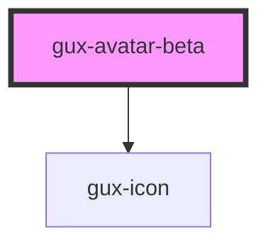

# gux-avatar-beta

<!-- Auto Generated Below -->

## Properties

| Property            | Attribute       | Description                                                                                                                                                            | Type                                                                                                                                                | Default     |
| ------------------- | --------------- | ---------------------------------------------------------------------------------------------------------------------------------------------------------------------- | --------------------------------------------------------------------------------------------------------------------------------------------------- | ----------- |
| `accent`            | `accent`        | Manually sets avatar accent                                                                                                                                            | `"0" \| "1" \| "10" \| "11" \| "12" \| "2" \| "3" \| "4" \| "5" \| "6" \| "7" \| "8" \| "9" \| "auto" \| "default" \| "inherit"`                    | `'default'` |
| `badge`             | `badge`         | Shows a badge indicating current presence                                                                                                                              | `boolean`                                                                                                                                           | `false`     |
| `label`             | `label`         | Label to display for accessibility                                                                                                                                     | `string`                                                                                                                                            | `undefined` |
| `name` _(required)_ | `name`          | Name which is shown as initials. Should be formatted 'Lastname Firstname' for JA, zhCN and KO names. Names without blank space will show first 2 characters of string. | `string`                                                                                                                                            | `undefined` |
| `notifications`     | `notifications` | Show notifications indicator                                                                                                                                           | `boolean`                                                                                                                                           | `false`     |
| `presence`          | `presence`      | Shows presence such as away or available. Must be combined with badge or ring props to take effect.                                                                    | `"available" \| "away" \| "break" \| "busy" \| "idle" \| "meal" \| "meeting" \| "none" \| "offline" \| "on-queue" \| "out-of-office" \| "training"` | `'none'`    |
| `ring`              | `ring`          | Shows a ring around the avatar indicating current presence                                                                                                             | `boolean`                                                                                                                                           | `false`     |
| `size`              | `size`          |                                                                                                                                                                        | `"large" \| "medium" \| "small" \| "xsmall"`                                                                                                        | `'large'`   |

## Slots

| Slot      | Description     |
| --------- | --------------- |
| `"image"` | Headshot photo. |

## Dependencies

### Depends on

- [gux-icon](../../stable/gux-icon)

### Graph

----------------------------------------------

*Built with [StencilJS](https://stenciljs.com/)*
