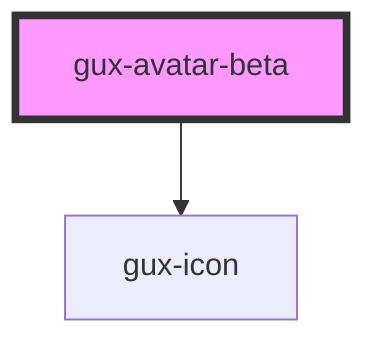

# gux-avatar-beta

<!-- Auto Generated Below -->

## Properties

| Property            | Attribute           | Description                                                | Type                                                                                 | Default       |
| ------------------- | ------------------- | ---------------------------------------------------------- | ------------------------------------------------------------------------------------ | ------------- |
| `accent`            | `accent`            |                                                            | `"auto" \| "default" \| 1 \| 10 \| 11 \| 12 \| 2 \| 3 \| 4 \| 5 \| 6 \| 7 \| 8 \| 9` | `'default'`   |
| `hasBadge`          | `has-badge`         | Shows a presence badge                                     | `boolean`                                                                            | `false`       |
| `hasNotifications`  | `has-notifications` | Override the presence badge with a notification icon       | `boolean`                                                                            | `false`       |
| `isInteractive`     | `is-interactive`    | Wrap the content with a button if it needs to be clickable | `boolean`                                                                            | `false`       |
| `name` _(required)_ | `name`              |                                                            | `string`                                                                             | `undefined`   |
| `presence`          | `presence`          |                                                            | `"available" \| "away" \| "busy" \| "offline" \| "on-queue" \| "out-of-office"`      | `'available'` |
| `presenceRing`      | `presence-ring`     | Shows a presence ring around the avatar                    | `boolean`                                                                            | `false`       |
| `size`              | `size`              |                                                            | `"large" \| "medium" \| "small" \| "xsmall"`                                         | `'large'`     |

## Slots

| Slot      | Description     |
| --------- | --------------- |
| `"image"` | Headshot photo. |

## Dependencies

### Depends on

- [gux-icon](../../stable/gux-icon)

### Graph

----------------------------------------------

*Built with [StencilJS](https://stenciljs.com/)*
