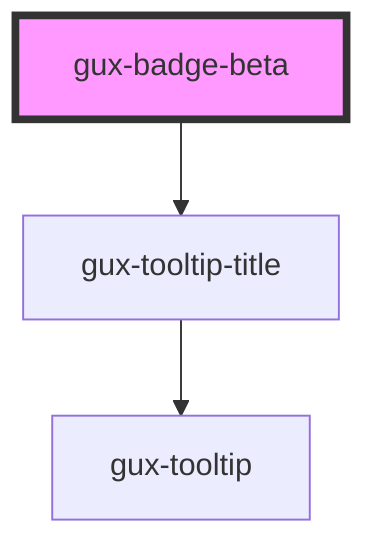

# gux-badge-beta

<!-- Auto Generated Below -->

## Properties

| Property | Attribute | Description | Type                                                       | Default     |
| -------- | --------- | ----------- | ---------------------------------------------------------- | ----------- |
| `accent` | `accent`  |             | `"error" \| "info" \| "inherit" \| "success" \| "warning"` | `'info'`    |
| `bold`   | `bold`    |             | `boolean`                                                  | `false`     |
| `color`  | `color`   |             | `"green" \| "inherit" \| "neutral" \| "red" \| "yellow"`   | `'neutral'` |

## Slots

| Slot | Description             |
| ---- | ----------------------- |
|      | Required slot for label |

## CSS Custom Properties

| Name                                        | Description |
| ------------------------------------------- | ----------- |
| `--gse-ui-badge-error-bold-background`      |             |
| `--gse-ui-badge-error-bold-foreground`      |             |
| `--gse-ui-badge-error-default-background`   |             |
| `--gse-ui-badge-error-default-foreground`   |             |
| `--gse-ui-badge-info-bold-background`       |             |
| `--gse-ui-badge-info-bold-foreground`       |             |
| `--gse-ui-badge-info-default-background`    |             |
| `--gse-ui-badge-info-default-foreground`    |             |
| `--gse-ui-badge-label-font-family`          |             |
| `--gse-ui-badge-label-font-size`            |             |
| `--gse-ui-badge-label-font-weight`          |             |
| `--gse-ui-badge-success-bold-background`    |             |
| `--gse-ui-badge-success-bold-foreground`    |             |
| `--gse-ui-badge-success-default-background` |             |
| `--gse-ui-badge-success-default-foreground` |             |
| `--gse-ui-badge-warning-bold-background`    |             |
| `--gse-ui-badge-warning-bold-foreground`    |             |
| `--gse-ui-badge-warning-default-background` |             |
| `--gse-ui-badge-warning-default-foreground` |             |

## Dependencies

### Depends on

- [gux-tooltip-title](../../stable/gux-tooltip-title)

### Graph

----------------------------------------------

*Built with [StencilJS](https://stenciljs.com/)*
