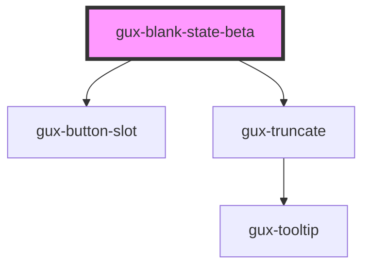

# gux-blank-state-beta

<!-- Auto Generated Below -->

## Properties

| Property    | Attribute    | Description | Type                 | Default    |
| ----------- | ------------ | ----------- | -------------------- | ---------- |
| `alignment` | `alignment`  |             | `"center" \| "left"` | `'center'` |
| `noPadding` | `no-padding` |             | `boolean`            | `false`    |

## Slots

| Slot                         | Description                                           |
| ---------------------------- | ----------------------------------------------------- |
| `"additional-guidance"`      | Slot for additional-guidance.                         |
| `"call-to-action"`           | Slot for the message call to action button.           |
| `"image"`                    | Slot for gux-icon element or gux-illustration-beta.   |
| `"primary-message"`          | Required slot for primary-message.                    |
| `"secondary-call-to-action"` | Slot for the message call to action secondary button. |

## Dependencies

### Depends on

- [gux-button-slot](../../stable/gux-button-slot)
- [gux-truncate](../../stable/gux-truncate)

### Graph

----------------------------------------------

*Built with [StencilJS](https://stenciljs.com/)*
