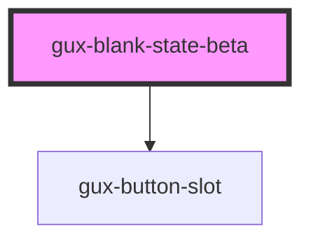

# gux-blank-state-beta

<!-- Auto Generated Below -->

## Properties

| Property    | Attribute   | Description | Type                                                                                                                                                                                                                                                                                                                                                                                                                                                                                                                                                                                          | Default     |
| ----------- | ----------- | ----------- | --------------------------------------------------------------------------------------------------------------------------------------------------------------------------------------------------------------------------------------------------------------------------------------------------------------------------------------------------------------------------------------------------------------------------------------------------------------------------------------------------------------------------------------------------------------------------------------------- | ----------- |
| `alignment` | `alignment` |             | `"center" \| "left"`                                                                                                                                                                                                                                                                                                                                                                                                                                                                                                                                                                          | `'center'`  |
| `variant`   | `variant`   |             | `"success" \| "add" \| "face-smile" \| "calendar" \| "access" \| "recording" \| "data" \| "comments" \| "comment" \| "comment-question" \| "eye" \| "magnifying-glass" \| "magnifying-glass-question" \| "sparkles" \| "triangle-exclamation" \| "face-disappointed" \| "folder-magnifying-glass" \| "folder-open" \| "file" \| "lock" \| "message-bot" \| "robot" \| "message" \| "messages" \| "cloud" \| "article" \| "edit" \| "connection" \| "rectangle-history" \| "setting" \| "square-dashed" \| "square-plus" \| "transcription" \| "table" \| "user" \| "user-message" \| "users"` | `undefined` |

## Slots

| Slot                    | Description                                 |
| ----------------------- | ------------------------------------------- |
| `"additional-guidance"` | Slot for additional-guidance.               |
| `"call-to-action"`      | Slot for the message call to action button. |
| `"image"`               | Slot for gux-icon element.                  |
| `"primary-message"`     | Required slot for primary-message.          |

## Dependencies

### Depends on

- [gux-button-slot](../../stable/gux-button-slot)

### Graph

```mermaid
graph TD;
  gux-blank-state-beta --> gux-button-slot
  style gux-blank-state-beta fill:#f9f,stroke:#333,stroke-width:4px
```

----------------------------------------------

*Built with [StencilJS](https://stenciljs.com/)*
