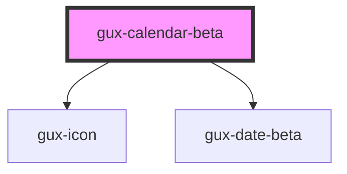

# gux-calendar-beta

<!-- Auto Generated Below -->

## Dependencies

### Depends on

- [gux-icon](../../../../stable/gux-icon)
- [gux-date-beta](../../../gux-date)

### Graph

----------------------------------------------

*Built with [StencilJS](https://stenciljs.com/)*
