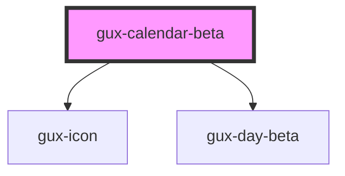

# gux-calendar-beta

<!-- Auto Generated Below -->

## Properties

| Property         | Attribute           | Description | Type                              | Default     |
| ---------------- | ------------------- | ----------- | --------------------------------- | ----------- |
| `startDayOfWeek` | `start-day-of-week` |             | `1 \| 2 \| 3 \| 4 \| 5 \| 6 \| 7` | `undefined` |

## Methods

### `guxForceUpdate() => Promise<void>`

#### Returns

Type: `Promise<void>`

## Dependencies

### Depends on

- [gux-icon](../../stable/gux-icon)
- [gux-day-beta](../gux-day)

### Graph

----------------------------------------------

*Built with [StencilJS](https://stenciljs.com/)*
