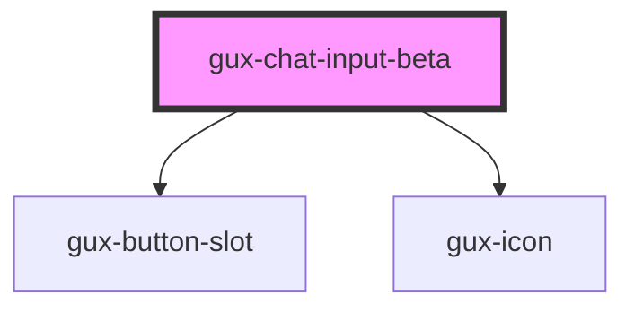

# gux-chat-input

<!-- Auto Generated Below -->

## Properties

| Property      | Attribute     | Description | Type     | Default     |
| ------------- | ------------- | ----------- | -------- | ----------- |
| `placeholder` | `placeholder` |             | `string` | `undefined` |

## Events

| Event               | Description                                                                  | Type               |
| ------------------- | ---------------------------------------------------------------------------- | ------------------ |
| `onchatinputsubmit` | Triggers when the CTA button is clicked to initiate Copilot text generating. | `CustomEvent<any>` |

## Methods

### `guxReset() => Promise<void>`

#### Returns

Type: `Promise<void>`

## Slots

| Slot                | Description                   |
| ------------------- | ----------------------------- |
| `"caution-message"` | slot for caution message text |

## Dependencies

### Depends on

- [gux-button-slot](../../stable/gux-button-slot)
- [gux-icon](../../stable/gux-icon)

### Graph

----------------------------------------------

*Built with [StencilJS](https://stenciljs.com/)*
