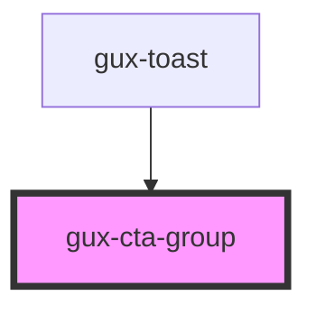

# gux-cta-group

<!-- Auto Generated Below -->

## Properties

| Property    | Attribute   | Description                                               | Type               | Default   |
| ----------- | ----------- | --------------------------------------------------------- | ------------------ | --------- |
| `align`     | `align`     | Sets the buttons alignment                                | `"end" \| "start"` | `'start'` |
| `dangerous` | `dangerous` | Defines if the primary button should have a danger accent | `boolean`          | `false`   |

## Dependencies

### Used by

 - [gux-toast](../../stable/gux-toast)

### Graph

----------------------------------------------

*Built with [StencilJS](https://stenciljs.com/)*
