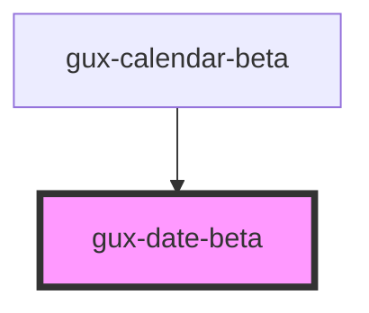

# gux-date-beta

<!-- Auto Generated Below -->

## Properties

| Property   | Attribute  | Description                                         | Type                                      | Default                    |
| ---------- | ---------- | --------------------------------------------------- | ----------------------------------------- | -------------------------- |
| `datetime` | `datetime` | The ISO string representation of the date to format | `string`                                  | `new Date().toISOString()` |
| `format`   | `format`   | Format option type                                  | `"full" \| "long" \| "medium" \| "short"` | `'short'`                  |

## Dependencies

### Used by

 - [gux-calendar-beta](../gux-calendar-beta/components/single)

### Graph

----------------------------------------------

*Built with [StencilJS](https://stenciljs.com/)*
