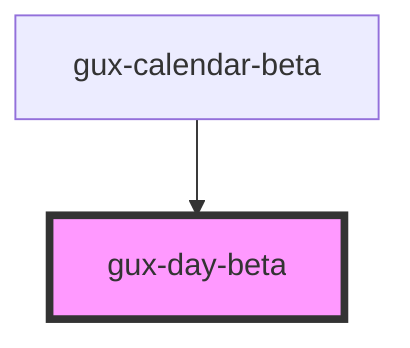

# gux-day

<!-- Auto Generated Below -->

## Overview

The gux-day component is how we render a day within an calendar. Custom-styled
instances can be slotted in to exiting calendars by users of Spark, but it
should not be used stand-alone.

## Properties

| Property | Attribute | Description | Type     | Default     |
| -------- | --------- | ----------- | -------- | ----------- |
| `day`    | `day`     |             | `string` | `undefined` |

## Events

| Event            | Description | Type                  |
| ---------------- | ----------- | --------------------- |
| `guxdayselected` |             | `CustomEvent<string>` |

## Dependencies

### Used by

 - [gux-calendar-beta](../gux-calendar-beta/components/single)

### Graph

----------------------------------------------

*Built with [StencilJS](https://stenciljs.com/)*
