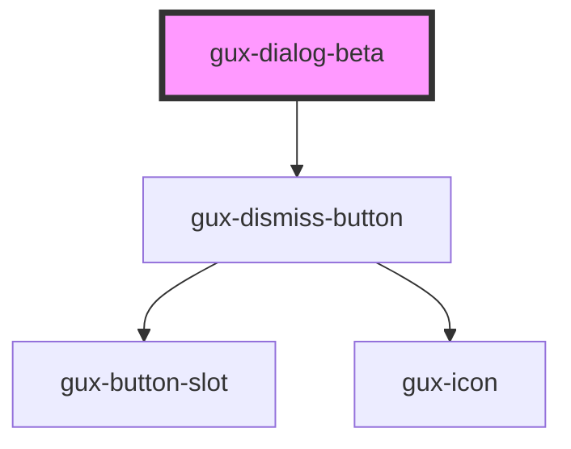

# gux-dialog-beta

<!-- Auto Generated Below -->

## Properties

| Property       | Attribute       | Description                                                                                                   | Type                                          | Default     |
| -------------- | --------------- | ------------------------------------------------------------------------------------------------------------- | --------------------------------------------- | ----------- |
| `initialFocus` | `initial-focus` | Query selector for the element to initially focus when the modal opens Defaults to the first tabbable element | `string`                                      | `undefined` |
| `isOpen`       | `is-open`       | Indicates if the modal is initially shown                                                                     | `boolean`                                     | `false`     |
| `size`         | `size`          | Indicates the size of the modal (small, medium or large)                                                      | `"dynamic" \| "large" \| "medium" \| "small"` | `'dynamic'` |

## Events

| Event        | Description                           | Type                |
| ------------ | ------------------------------------- | ------------------- |
| `guxdismiss` | Fired when a user dismisses the modal | `CustomEvent<void>` |

## Methods

### `hideModal() => Promise<void>`

#### Returns

Type: `Promise<void>`

### `showModal() => Promise<void>`

#### Returns

Type: `Promise<void>`

## Dependencies

### Depends on

- [gux-dismiss-button](../../stable/gux-dismiss-button)

### Graph

----------------------------------------------

*Built with [StencilJS](https://stenciljs.com/)*
