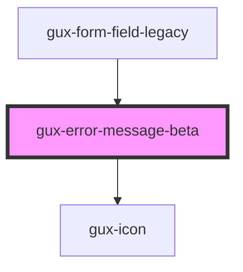

# gux-input

<!-- Auto Generated Below -->

## Slots

| Slot      | Description                                                               |
| --------- | ------------------------------------------------------------------------- |
|           | Alternative slot for setting error message if named slot can not be used. |
| `"error"` | Slot for error massage                                                    |

## Dependencies

### Used by

 - [gux-form-field-legacy](../../legacy/gux-form-field-legacy)

### Depends on

- [gux-icon](../../stable/gux-icon)

### Graph

----------------------------------------------

*Built with [StencilJS](https://stenciljs.com/)*
