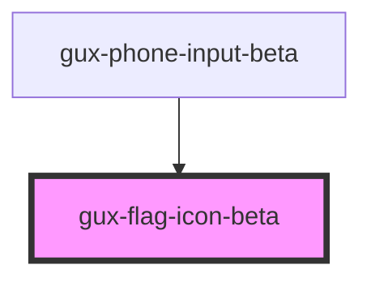

# gux-country-icon

<!-- Auto Generated Below -->

## Properties

| Property           | Attribute           | Description | Type                                                                                                                                                                                                                                                                                                                                                                                                                                                                                                                                                                                                                                                                                                                                                                                                                                                                                                                                                                                                                                                                                                                                                                                                                                                                                                                                                                                                                                                                                                                                                                                                                                                                                                                                                                                                                                                                                                                                                                                                                                           | Default     |
| ------------------ | ------------------- | ----------- | ---------------------------------------------------------------------------------------------------------------------------------------------------------------------------------------------------------------------------------------------------------------------------------------------------------------------------------------------------------------------------------------------------------------------------------------------------------------------------------------------------------------------------------------------------------------------------------------------------------------------------------------------------------------------------------------------------------------------------------------------------------------------------------------------------------------------------------------------------------------------------------------------------------------------------------------------------------------------------------------------------------------------------------------------------------------------------------------------------------------------------------------------------------------------------------------------------------------------------------------------------------------------------------------------------------------------------------------------------------------------------------------------------------------------------------------------------------------------------------------------------------------------------------------------------------------------------------------------------------------------------------------------------------------------------------------------------------------------------------------------------------------------------------------------------------------------------------------------------------------------------------------------------------------------------------------------------------------------------------------------------------------------------------------------- | ----------- |
| `flag`             | `flag`              |             | `"AD" \| "AE" \| "AF" \| "AG" \| "AI" \| "AL" \| "AM" \| "AO" \| "AR" \| "AS" \| "AT" \| "AU" \| "AW" \| "AX" \| "AZ" \| "BA" \| "BB" \| "BD" \| "BE" \| "BF" \| "BG" \| "BH" \| "BI" \| "BJ" \| "BL" \| "BM" \| "BN" \| "BO" \| "BQ" \| "BR" \| "BS" \| "BT" \| "BV" \| "BW" \| "BY" \| "BZ" \| "CA" \| "CC" \| "CD" \| "CF" \| "CG" \| "CH" \| "CI" \| "CK" \| "CL" \| "CM" \| "CN" \| "CO" \| "CR" \| "CU" \| "CV" \| "CW" \| "CX" \| "CY" \| "CZ" \| "DE" \| "DJ" \| "DK" \| "DM" \| "DO" \| "DZ" \| "EC" \| "EE" \| "EG" \| "EH" \| "ER" \| "ES" \| "ET" \| "FI" \| "FJ" \| "FK" \| "FM" \| "FO" \| "FR" \| "GA" \| "GB" \| "GD" \| "GE" \| "GF" \| "GG" \| "GH" \| "GI" \| "GL" \| "GM" \| "GN" \| "GP" \| "GQ" \| "GR" \| "GS" \| "GT" \| "GU" \| "GW" \| "GY" \| "HK" \| "HN" \| "HR" \| "HT" \| "HU" \| "ID" \| "IE" \| "IL" \| "IM" \| "IN" \| "IO" \| "IQ" \| "IR" \| "IS" \| "IT" \| "JE" \| "JM" \| "JO" \| "JP" \| "KE" \| "KG" \| "KH" \| "KI" \| "KM" \| "KN" \| "KP" \| "KR" \| "KW" \| "KY" \| "KZ" \| "LA" \| "LB" \| "LC" \| "LI" \| "LK" \| "LR" \| "LS" \| "LT" \| "LU" \| "LV" \| "LY" \| "MA" \| "MC" \| "MD" \| "ME" \| "MF" \| "MG" \| "MH" \| "MK" \| "ML" \| "MM" \| "MN" \| "MO" \| "MP" \| "MQ" \| "MR" \| "MS" \| "MT" \| "MU" \| "MV" \| "MW" \| "MX" \| "MY" \| "MZ" \| "NA" \| "NC" \| "NE" \| "NF" \| "NG" \| "NI" \| "NL" \| "NO" \| "NP" \| "NR" \| "NU" \| "NZ" \| "OM" \| "PA" \| "PE" \| "PF" \| "PG" \| "PH" \| "PK" \| "PL" \| "PM" \| "PN" \| "PR" \| "PS" \| "PT" \| "PW" \| "PY" \| "QA" \| "RE" \| "RO" \| "RS" \| "RU" \| "RW" \| "SA" \| "SB" \| "SC" \| "SD" \| "SE" \| "SG" \| "SH" \| "SI" \| "SJ" \| "SK" \| "SL" \| "SM" \| "SN" \| "SO" \| "SR" \| "SS" \| "ST" \| "SV" \| "SX" \| "SY" \| "SZ" \| "TC" \| "TD" \| "TG" \| "TH" \| "TJ" \| "TK" \| "TL" \| "TM" \| "TN" \| "TO" \| "TR" \| "TT" \| "TV" \| "TW" \| "TZ" \| "UA" \| "UG" \| "US" \| "UY" \| "UZ" \| "VA" \| "VC" \| "VE" \| "VG" \| "VI" \| "VN" \| "VU" \| "WF" \| "WS" \| "XK" \| "YE" \| "YT" \| "ZA" \| "ZM" \| "ZW"` | `undefined` |
| `screenreaderText` | `screenreader-text` |             | `string`                                                                                                                                                                                                                                                                                                                                                                                                                                                                                                                                                                                                                                                                                                                                                                                                                                                                                                                                                                                                                                                                                                                                                                                                                                                                                                                                                                                                                                                                                                                                                                                                                                                                                                                                                                                                                                                                                                                                                                                                                                       | `undefined` |

## Dependencies

### Used by

 - [gux-phone-input-beta](../gux-phone-input)

### Graph

----------------------------------------------

*Built with [StencilJS](https://stenciljs.com/)*
