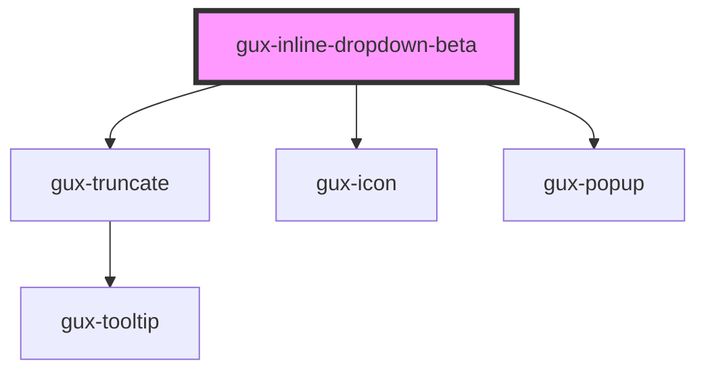

# gux-inline-dropdown

<!-- Auto Generated Below -->

## Overview

Our Dropdown component. In the most basic case, it's used with `gux-option` to give users
a list of text options to select from, but other types of options with different appearance
can be created by creating a new component and adding it to `validOptionTags` list in
gux-dropdown-types.ts, then following the resulting compiler errors.

## Properties

| Property      | Attribute     | Description | Type      | Default     |
| ------------- | ------------- | ----------- | --------- | ----------- |
| `placeholder` | `placeholder` |             | `string`  | `undefined` |
| `required`    | `required`    |             | `boolean` | `false`     |
| `value`       | `value`       |             | `string`  | `undefined` |

## Events

| Event          | Description | Type                |
| -------------- | ----------- | ------------------- |
| `guxcollapsed` |             | `CustomEvent<void>` |
| `guxexpanded`  |             | `CustomEvent<void>` |

## Slots

| Slot | Description                                               |
| ---- | --------------------------------------------------------- |
|      | for a gux-listbox containing ValidDropdownOption children |

## Dependencies

### Depends on

- [gux-truncate](../../stable/gux-truncate)
- [gux-icon](../../stable/gux-icon)
- [gux-popup](../../stable/gux-popup)

### Graph

----------------------------------------------

*Built with [StencilJS](https://stenciljs.com/)*
