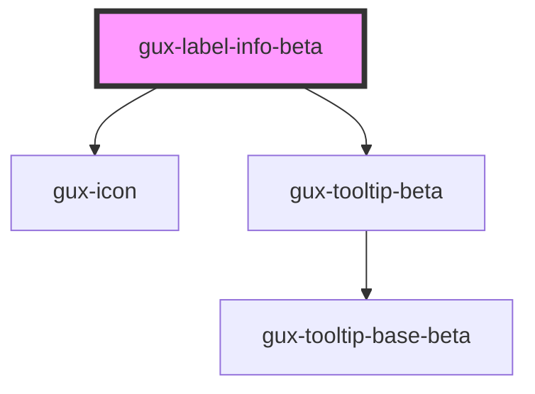

# gux-label-info-beta

<!-- Auto Generated Below -->

## Properties

| Property    | Attribute   | Description | Type                                                                                                                                                                 | Default   |
| ----------- | ----------- | ----------- | -------------------------------------------------------------------------------------------------------------------------------------------------------------------- | --------- |
| `placement` | `placement` |             | `"bottom" \| "bottom-end" \| "bottom-start" \| "left" \| "left-end" \| "left-start" \| "right" \| "right-end" \| "right-start" \| "top" \| "top-end" \| "top-start"` | `'right'` |
| `variant`   | `variant`   |             | `"info" \| "question"`                                                                                                                                               | `'info'`  |

## Methods

### `hideTooltip() => Promise<void>`

#### Returns

Type: `Promise<void>`

### `showTooltip() => Promise<void>`

#### Returns

Type: `Promise<void>`

## Slots

| Slot        | Description                                        |
| ----------- | -------------------------------------------------- |
| `"content"` | Required slot for tooltip and screenreader content |

## Dependencies

### Depends on

- [gux-icon](../../stable/gux-icon)
- [gux-tooltip-beta](../gux-tooltip-beta)

### Graph

----------------------------------------------

*Built with [StencilJS](https://stenciljs.com/)*
