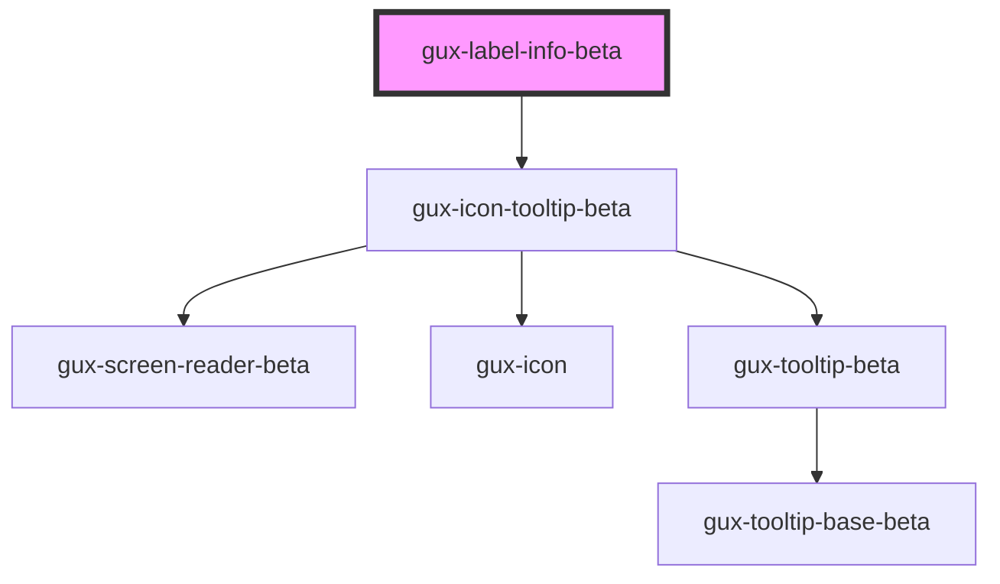

# gux-form-field-additional-info-beta

<!-- Auto Generated Below -->

## Properties

| Property  | Attribute | Description | Type                   | Default  |
| --------- | --------- | ----------- | ---------------------- | -------- |
| `variant` | `variant` |             | `"info" \| "question"` | `'info'` |

## Methods

### `hideTooltip() => Promise<void>`

#### Returns

Type: `Promise<void>`

### `showTooltip() => Promise<void>`

#### Returns

Type: `Promise<void>`

## Slots

| Slot        | Description |
| ----------- | ----------- |
| `"content"` |             |

## Dependencies

### Depends on

- [gux-icon-tooltip-beta](../gux-icon-tooltip)

### Graph

```mermaid
graph TD;
  gux-label-info-beta --> gux-icon-tooltip-beta
  gux-icon-tooltip-beta --> gux-screen-reader-beta
  gux-icon-tooltip-beta --> gux-icon
  gux-icon-tooltip-beta --> gux-tooltip-beta
  gux-tooltip-beta --> gux-tooltip-base-beta
  style gux-label-info-beta fill:#f9f,stroke:#333,stroke-width:4px
```

----------------------------------------------

*Built with [StencilJS](https://stenciljs.com/)*
