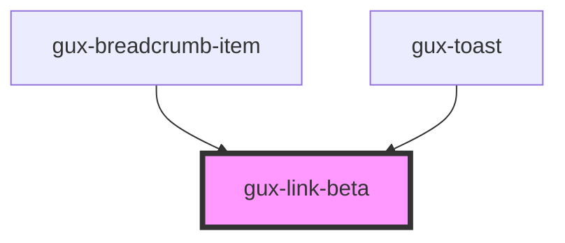

# gux-link-beta

<!-- Auto Generated Below -->

## Properties

| Property     | Attribute    | Description | Type                  | Default    |
| ------------ | ------------ | ----------- | --------------------- | ---------- |
| `size`       | `size`       |             | `"medium" \| "small"` | `'medium'` |
| `standalone` | `standalone` |             | `boolean`             | `false`    |

## Dependencies

### Used by

 - [gux-breadcrumb-item](../../stable/gux-breadcrumbs/breadcrumb-item)
 - [gux-toast](../../stable/gux-toast)

### Graph

----------------------------------------------

*Built with [StencilJS](https://stenciljs.com/)*
