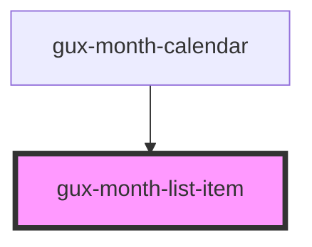

# gux-month-list-item

<!-- Auto Generated Below -->

## Properties

| Property   | Attribute  | Description | Type                        | Default     |
| ---------- | ---------- | ----------- | --------------------------- | ----------- |
| `disabled` | `disabled` |             | `boolean`                   | `false`     |
| `selected` | `selected` |             | `boolean`                   | `false`     |
| `value`    | `value`    |             | `` `${string}-${string}` `` | `undefined` |

## Dependencies

### Used by

 - [gux-month-calendar](../..)

### Graph

----------------------------------------------

*Built with [StencilJS](https://stenciljs.com/)*
