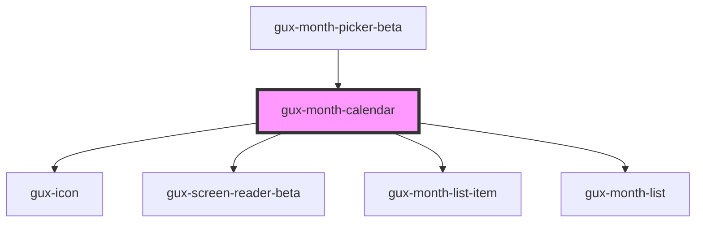

# gux-month-calendar

<!-- Auto Generated Below -->

## Properties

| Property | Attribute | Description                                                     | Type                        | Default     |
| -------- | --------- | --------------------------------------------------------------- | --------------------------- | ----------- |
| `max`    | `max`     | The max year and month selectable in ISO8601 format (yyyy-mm)   | `` `${string}-${string}` `` | `undefined` |
| `min`    | `min`     | The min year and month selectable in ISO8601 format (yyyy-mm)   | `` `${string}-${string}` `` | `undefined` |
| `value`  | `value`   | The current selected year and month in ISO8601 format (yyyy-mm) | `` `${string}-${string}` `` | `undefined` |

## Methods

### `guxFocus(iSOYearMonth: GuxISOYearMonth) => Promise<void>`

Focus a month

#### Parameters

| Name           | Type                    | Description |
| -------------- | ----------------------- | ----------- |
| `iSOYearMonth` | ``${string}-${string}`` |             |

#### Returns

Type: `Promise<void>`

## Dependencies

### Used by

 - [gux-month-picker-beta](..)

### Depends on

- [gux-icon](../../../stable/gux-icon)
- [gux-screen-reader-beta](../../gux-screen-reader)
- [gux-month-list-item](./gux-month-list/gux-month-list-item)
- [gux-month-list](gux-month-list)

### Graph

----------------------------------------------

*Built with [StencilJS](https://stenciljs.com/)*
