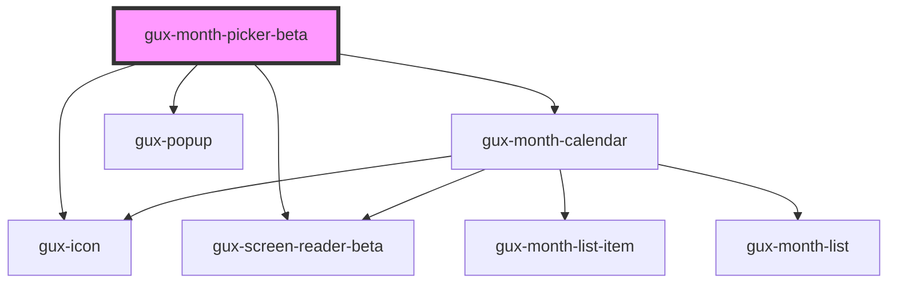

# gux-month-picker

<!-- Auto Generated Below -->

## Properties

| Property   | Attribute  | Description                                                     | Type                        | Default     |
| ---------- | ---------- | --------------------------------------------------------------- | --------------------------- | ----------- |
| `disabled` | `disabled` |                                                                 | `boolean`                   | `false`     |
| `max`      | `max`      | The max year and month selectable in ISO8601 format (yyyy-mm)   | `` `${string}-${string}` `` | `undefined` |
| `min`      | `min`      | The min year and month selectable in ISO8601 format (yyyy-mm)   | `` `${string}-${string}` `` | `undefined` |
| `value`    | `value`    | The current selected year and month in ISO8601 format (yyyy-mm) | `` `${string}-${string}` `` | `undefined` |

## Dependencies

### Depends on

- [gux-icon](../../stable/gux-icon)
- [gux-screen-reader-beta](../gux-screen-reader)
- [gux-month-calendar](gux-month-calendar)
- [gux-popup](../../stable/gux-popup)

### Graph

----------------------------------------------

*Built with [StencilJS](https://stenciljs.com/)*
