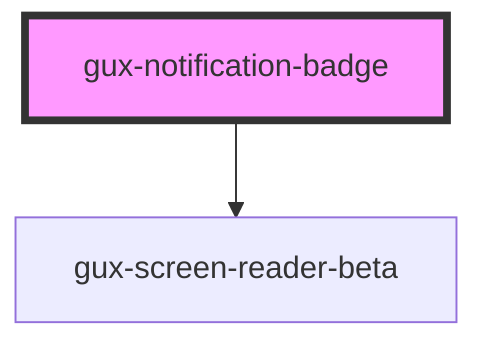

# gux-notification-badge

<!-- Auto Generated Below -->

## Properties

| Property | Attribute | Description | Type                                                                                  | Default          |
| -------- | --------- | ----------- | ------------------------------------------------------------------------------------- | ---------------- |
| `accent` | `accent`  |             | `"error" \| "info-on-dark" \| "info-on-light" \| "inherit" \| "success" \| "warning"` | `'info-on-dark'` |
| `size`   | `size`    |             | `"large" \| "medium" \| "small"`                                                      | `'medium'`       |

## Slots

| Slot | Description                           |
| ---- | ------------------------------------- |
|      | Slot for up to 3 digits or a gux-icon |

## Dependencies

### Depends on

- [gux-screen-reader-beta](../gux-screen-reader)

### Graph

----------------------------------------------

*Built with [StencilJS](https://stenciljs.com/)*
