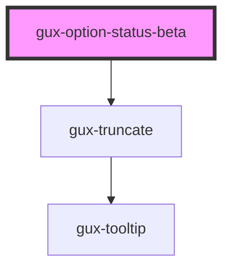

# gux-label-info-beta

<!-- Auto Generated Below -->

## Properties

| Property   | Attribute  | Description | Type                                          | Default     |
| ---------- | ---------- | ----------- | --------------------------------------------- | ----------- |
| `accent`   | `accent`   |             | `"error" \| "info" \| "success" \| "warning"` | `'info'`    |
| `active`   | `active`   |             | `boolean`                                     | `false`     |
| `disabled` | `disabled` |             | `boolean`                                     | `false`     |
| `selected` | `selected` |             | `boolean`                                     | `false`     |
| `value`    | `value`    |             | `string`                                      | `undefined` |

## Slots

| Slot        | Description                         |
| ----------- | ----------------------------------- |
| `"default"` | Slot for the status indicator text. |

## Dependencies

### Depends on

- [gux-truncate](../../stable/gux-truncate)

### Graph

----------------------------------------------

*Built with [StencilJS](https://stenciljs.com/)*
