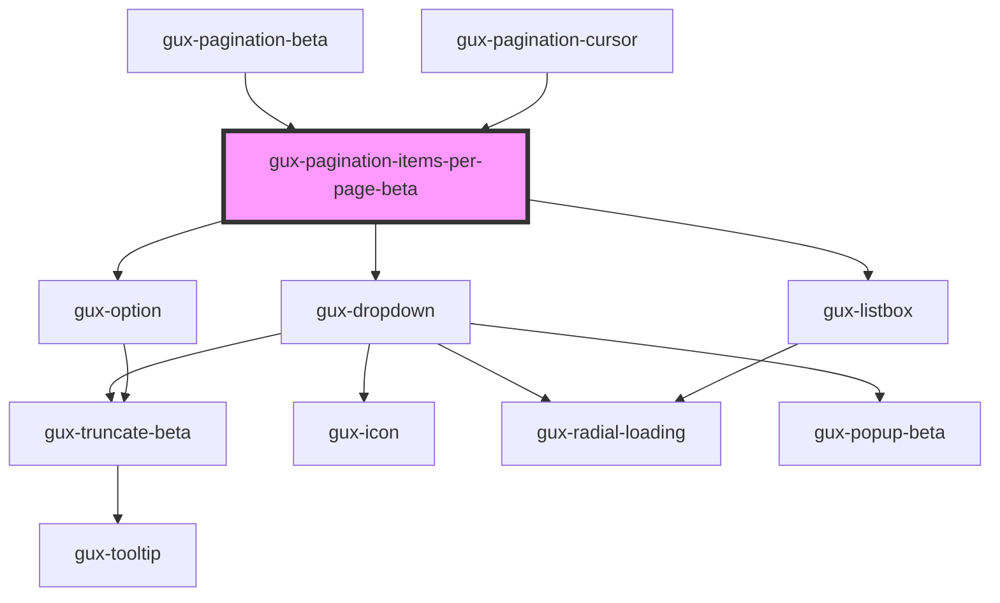

# gux-pagination-items-per-page

An internal component used by the gux-pagination component.

<!-- Auto Generated Below -->

## Properties

| Property       | Attribute        | Description | Type                    | Default |
| -------------- | ---------------- | ----------- | ----------------------- | ------- |
| `itemsPerPage` | `items-per-page` |             | `100 \| 25 \| 50 \| 75` | `25`    |

## Events

| Event                        | Description | Type                  |
| ---------------------------- | ----------- | --------------------- |
| `internalitemsperpagechange` |             | `CustomEvent<number>` |

## Dependencies

### Used by

 - [gux-pagination-beta](..)
 - [gux-pagination-cursor](../../../stable/gux-pagination-cursor)

### Depends on

- [gux-dropdown](../../../stable/gux-dropdown)
- [gux-listbox](../../../stable/gux-listbox)
- [gux-option](../../../stable/gux-listbox/options/gux-option)

### Graph

----------------------------------------------

*Built with [StencilJS](https://stenciljs.com/)*
