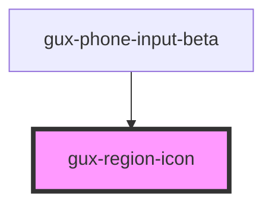

# gux-country-icon

<!-- Auto Generated Below -->

## Properties

| Property           | Attribute           | Description | Type     | Default     |
| ------------------ | ------------------- | ----------- | -------- | ----------- |
| `region`           | `region`            |             | `string` | `undefined` |
| `screenreaderText` | `screenreader-text` |             | `string` | `undefined` |

## Dependencies

### Used by

 - [gux-phone-input-beta](../..)

### Graph

----------------------------------------------

*Built with [StencilJS](https://stenciljs.com/)*
