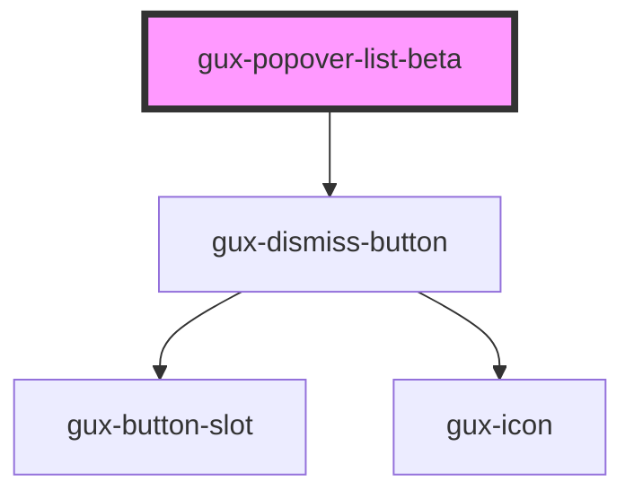

# gux-popover-list-beta

<!-- Auto Generated Below -->

## Properties

| Property               | Attribute                | Description                                                                             | Type                                                                                                                                                                 | Default     |
| ---------------------- | ------------------------ | --------------------------------------------------------------------------------------- | -------------------------------------------------------------------------------------------------------------------------------------------------------------------- | ----------- |
| `closeOnClickOutside`  | `close-on-click-outside` | Close popover when the user clicks outside of its bounds                                | `boolean`                                                                                                                                                            | `false`     |
| `displayDismissButton` | `display-dismiss-button` | Indicate if the dismiss button is displayed                                             | `boolean`                                                                                                                                                            | `undefined` |
| `for`                  | `for`                    | Indicates the id of the element the popover should anchor to                            | `string`                                                                                                                                                             | `undefined` |
| `isOpen`               | `is-open`                | Controls hiding and showing the popover                                                 | `boolean`                                                                                                                                                            | `false`     |
| `position`             | `position`               | Indicate position of popover element arrow (follow floating ui placement attribute api) | `"bottom" \| "bottom-end" \| "bottom-start" \| "left" \| "left-end" \| "left-start" \| "right" \| "right-end" \| "right-start" \| "top" \| "top-end" \| "top-start"` | `'bottom'`  |

## Events

| Event        | Description                             | Type                |
| ------------ | --------------------------------------- | ------------------- |
| `guxdismiss` | Fired when a user dismisses the popover | `CustomEvent<void>` |

## Slots

| Slot | Description     |
| ---- | --------------- |
|      | popover content |

## Dependencies

### Depends on

- [gux-dismiss-button](../../stable/gux-dismiss-button)

### Graph

----------------------------------------------

*Built with [StencilJS](https://stenciljs.com/)*
