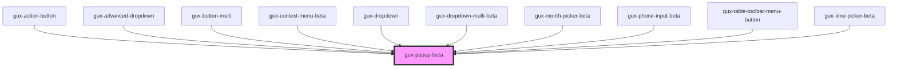

# gux-popup-beta

<!-- Auto Generated Below -->

## Properties

| Property            | Attribute             | Description                                                            | Type      | Default |
| ------------------- | --------------------- | ---------------------------------------------------------------------- | --------- | ------- |
| `disabled`          | `disabled`            |                                                                        | `boolean` | `false` |
| `exceedTargetWidth` | `exceed-target-width` | set if parent component design allows for popup exceeding target width | `boolean` | `false` |
| `expanded`          | `expanded`            |                                                                        | `boolean` | `false` |

## Events

| Event               | Description                                                          | Type                |
| ------------------- | -------------------------------------------------------------------- | ------------------- |
| `internalcollapsed` | This event will run when the popup transitions to a collapsed state. | `CustomEvent<void>` |
| `internalexpanded`  | This event will run when the popup transitions to an expanded state. | `CustomEvent<void>` |

## Slots

| Slot       | Description              |
| ---------- | ------------------------ |
| `"popup"`  | Required slot for popup  |
| `"target"` | Required slot for target |

## Dependencies

### Used by

 - [gux-action-button](../../stable/gux-action-button)
 - [gux-advanced-dropdown](../../stable/gux-advanced-dropdown)
 - [gux-button-multi](../../stable/gux-button-multi)
 - [gux-context-menu-beta](../gux-context-menu)
 - [gux-dropdown](../../stable/gux-dropdown)
 - [gux-dropdown-multi-beta](../gux-dropdown-multi)
 - [gux-month-picker-beta](../gux-month-picker)
 - [gux-phone-input-beta](../gux-phone-input)
 - [gux-table-toolbar-menu-button](../gux-table-toolbar/gux-table-toolbar-menu-button)
 - [gux-time-picker-beta](../gux-time-picker)

### Graph

----------------------------------------------

*Built with [StencilJS](https://stenciljs.com/)*
