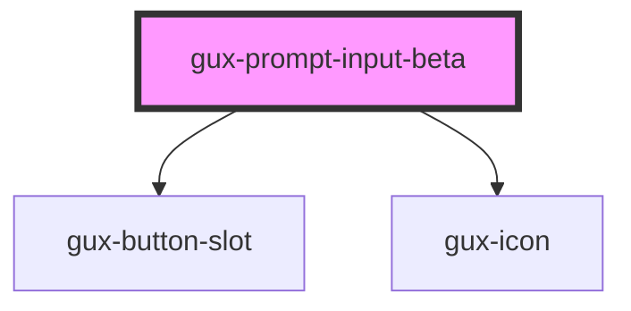

# gux-prompt-input-beta

<!-- Auto Generated Below -->

## Properties

| Property      | Attribute     | Description | Type     | Default     |
| ------------- | ------------- | ----------- | -------- | ----------- |
| `placeholder` | `placeholder` |             | `string` | `undefined` |

## Events

| Event                   | Description                                                                                      | Type                                                         |
| ----------------------- | ------------------------------------------------------------------------------------------------ | ------------------------------------------------------------ |
| `onpromptinputgenerate` | Triggers when the generate button is clicked to either initiate or stop Copilot text generation. | `CustomEvent<{ inputText: string; isGenerating: boolean; }>` |

## Slots

| Slot                | Description                   |
| ------------------- | ----------------------------- |
| `"caution-message"` | slot for caution message text |

## Dependencies

### Depends on

- [gux-button-slot](../../stable/gux-button-slot)
- [gux-icon](../../stable/gux-icon)

### Graph

----------------------------------------------

*Built with [StencilJS](https://stenciljs.com/)*
