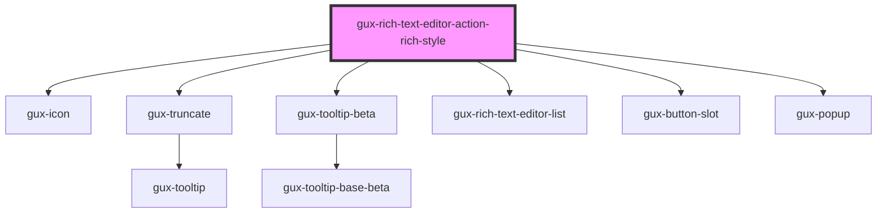

# gux-rich-text-editor-action-rich-style

<!-- Auto Generated Below -->

## Properties

| Property   | Attribute  | Description | Type      | Default     |
| ---------- | ---------- | ----------- | --------- | ----------- |
| `disabled` | `disabled` |             | `boolean` | `false`     |
| `value`    | `value`    |             | `string`  | `undefined` |

## Slots

| Slot | Description                                            |
| ---- | ------------------------------------------------------ |
|      | for a collection of gux-rich-style-list-item elements. |

## Dependencies

### Depends on

- [gux-icon](../../../../stable/gux-icon)
- [gux-truncate](../../../../stable/gux-truncate)
- [gux-tooltip-beta](../../../gux-tooltip-beta)
- [gux-rich-text-editor-list](../../gux-rich-text-editor-list)
- [gux-button-slot](../../../../stable/gux-button-slot)
- [gux-popup](../../../../stable/gux-popup)

### Graph

----------------------------------------------

*Built with [StencilJS](https://stenciljs.com/)*
