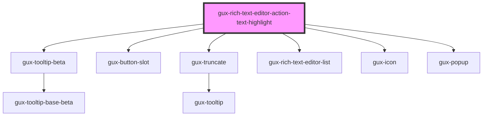

# gux-rich-text-editor-action-text-highlight

<!-- Auto Generated Below -->

## Properties

| Property   | Attribute   | Description | Type      | Default |
| ---------- | ----------- | ----------- | --------- | ------- |
| `disabled` | `disabled`  |             | `boolean` | `false` |
| `isActive` | `is-active` |             | `boolean` | `false` |

## Events

| Event               | Description | Type                |
| ------------------- | ----------- | ------------------- |
| `noHighlightAction` |             | `CustomEvent<void>` |

## Slots

| Slot | Description                                       |
| ---- | ------------------------------------------------- |
|      | for a collection of gux-rich-highlight-list-item. |

## Dependencies

### Depends on

- [gux-tooltip-beta](../../../gux-tooltip-beta)
- [gux-button-slot](../../../../stable/gux-button-slot)
- [gux-truncate](../../../../stable/gux-truncate)
- [gux-rich-text-editor-list](../../gux-rich-text-editor-list)
- [gux-icon](../../../../stable/gux-icon)
- [gux-popup](../../../../stable/gux-popup)

### Graph

----------------------------------------------

*Built with [StencilJS](https://stenciljs.com/)*
