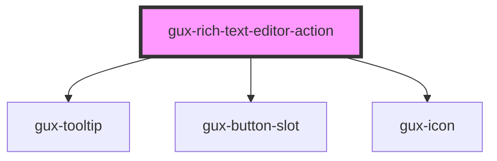

# gux-rich-text-editor-action

<!-- Auto Generated Below -->

## Properties

| Property   | Attribute  | Description | Type                                            | Default     |
| ---------- | ---------- | ----------- | ----------------------------------------------- | ----------- |
| `action`   | `action`   |             | `"bold" \| "italic" \| "strike" \| "underline"` | `undefined` |
| `disabled` | `disabled` |             | `boolean`                                       | `false`     |

## Methods

### `setEditor(editor: Editor) => Promise<void>`

#### Parameters

| Name     | Type     | Description |
| -------- | -------- | ----------- |
| `editor` | `Editor` |             |

#### Returns

Type: `Promise<void>`

## Dependencies

### Depends on

- [gux-tooltip](../../../stable/gux-tooltip)
- [gux-button-slot](../../../stable/gux-button-slot)
- [gux-icon](../../../stable/gux-icon)

### Graph

----------------------------------------------

*Built with [StencilJS](https://stenciljs.com/)*
