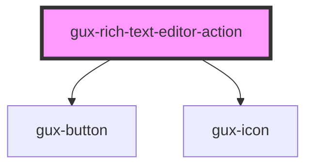

# gux-rich-text-editor-action

<!-- Auto Generated Below -->

## Properties

| Property | Attribute | Description | Type                 | Default     |
| -------- | --------- | ----------- | -------------------- | ----------- |
| `action` | `action`  |             | `"bold" \| "italic"` | `undefined` |

## Methods

### `setEditor(editor: Editor) => Promise<void>`

#### Parameters

| Name     | Type     | Description |
| -------- | -------- | ----------- |
| `editor` | `Editor` |             |

#### Returns

Type: `Promise<void>`

## Dependencies

### Depends on

- [gux-button](../../../stable/gux-button)
- [gux-icon](../../../stable/gux-icon)

### Graph

----------------------------------------------

*Built with [StencilJS](https://stenciljs.com/)*
