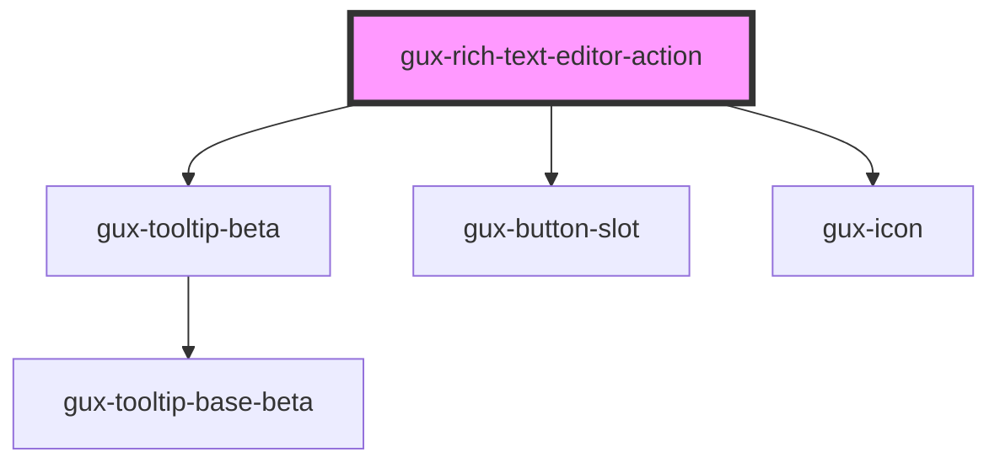

# gux-rich-text-editor-action

<!-- Auto Generated Below -->

## Properties

| Property   | Attribute   | Description | Type                                                                                                                                                                 | Default     |
| ---------- | ----------- | ----------- | -------------------------------------------------------------------------------------------------------------------------------------------------------------------- | ----------- |
| `action`   | `action`    |             | `"blockQuote" \| "bold" \| "bulletList" \| "clearFormatting" \| "codeblock" \| "delete" \| "italic" \| "orderedList" \| "redo" \| "strike" \| "underline" \| "undo"` | `undefined` |
| `disabled` | `disabled`  |             | `boolean`                                                                                                                                                            | `false`     |
| `isActive` | `is-active` |             | `boolean`                                                                                                                                                            | `false`     |

## Dependencies

### Depends on

- [gux-tooltip-beta](../../gux-tooltip-beta)
- [gux-button-slot](../../../stable/gux-button-slot)
- [gux-icon](../../../stable/gux-icon)

### Graph

----------------------------------------------

*Built with [StencilJS](https://stenciljs.com/)*
