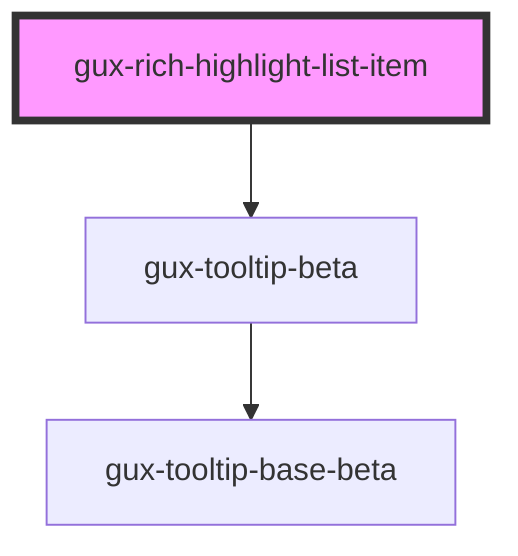

# gux-rich-highlight-list-item

<!-- Auto Generated Below -->

## Properties

| Property    | Attribute   | Description | Type                                                                                                      | Default     |
| ----------- | ----------- | ----------- | --------------------------------------------------------------------------------------------------------- | ----------- |
| `disabled`  | `disabled`  |             | `boolean`                                                                                                 | `false`     |
| `highlight` | `highlight` |             | `"blue" \| "coral" \| "inherit" \| "island" \| "mango" \| "mineral" \| "orange" \| "pear" \| "raspberry"` | `'orange'`  |
| `value`     | `value`     |             | `string`                                                                                                  | `undefined` |

## Dependencies

### Depends on

- [gux-tooltip-beta](../../../gux-tooltip-beta)

### Graph

----------------------------------------------

*Built with [StencilJS](https://stenciljs.com/)*
