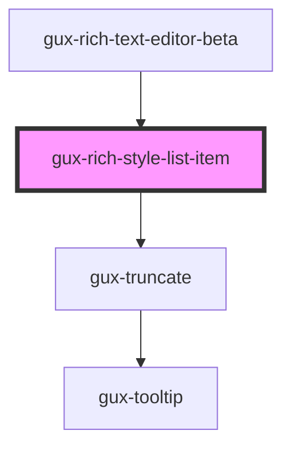

# gux-rich-style-list-item

<!-- Auto Generated Below -->

## Properties

| Property   | Attribute  | Description | Type      | Default     |
| ---------- | ---------- | ----------- | --------- | ----------- |
| `disabled` | `disabled` |             | `boolean` | `false`     |
| `value`    | `value`    |             | `string`  | `undefined` |

## Slots

| Slot | Description |
| ---- | ----------- |
|      | text        |

## Dependencies

### Used by

 - [gux-rich-text-editor-beta](../..)

### Depends on

- [gux-truncate](../../../../stable/gux-truncate)

### Graph

----------------------------------------------

*Built with [StencilJS](https://stenciljs.com/)*
