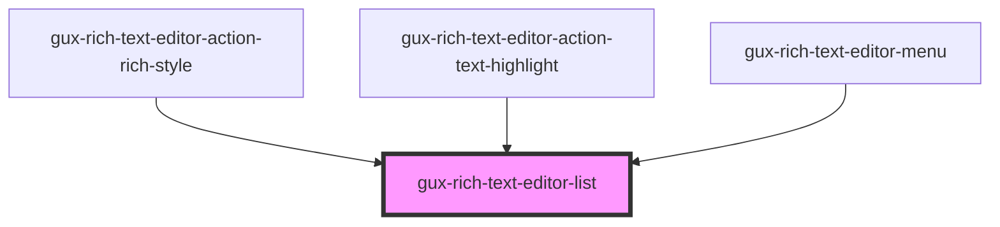

# gux-rich-text-editor-list

<!-- Auto Generated Below -->

## Properties

| Property | Attribute | Description | Type     | Default     |
| -------- | --------- | ----------- | -------- | ----------- |
| `value`  | `value`   |             | `string` | `undefined` |

## Events

| Event                      | Description | Type               |
| -------------------------- | ----------- | ------------------ |
| `internallistitemsupdated` |             | `CustomEvent<any>` |

## Methods

### `guxFocusFirstItem() => Promise<void>`

#### Returns

Type: `Promise<void>`

### `guxFocusLastItem() => Promise<void>`

#### Returns

Type: `Promise<void>`

## Dependencies

### Used by

 - [gux-rich-text-editor-action-rich-style](../gux-rich-text-editor-action/gux-rich-text-editor-action-rich-style)
 - [gux-rich-text-editor-action-text-highlight](../gux-rich-text-editor-action/gux-rich-text-editor-action-text-highlight)
 - [gux-rich-text-editor-menu](../gux-rich-text-editor-menu)

### Graph

----------------------------------------------

*Built with [StencilJS](https://stenciljs.com/)*
