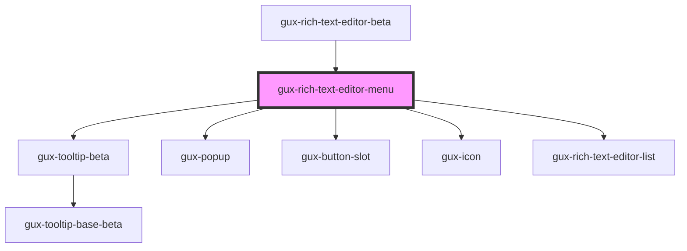

# gux-rich-text-editor-menu

<!-- Auto Generated Below -->

## Dependencies

### Used by

 - [gux-rich-text-editor-beta](..)

### Depends on

- [gux-tooltip-beta](../../gux-tooltip-beta)
- [gux-popup](../../../stable/gux-popup)
- [gux-button-slot](../../../stable/gux-button-slot)
- [gux-icon](../../../stable/gux-icon)
- [gux-rich-text-editor-list](../gux-rich-text-editor-list)

### Graph

----------------------------------------------

*Built with [StencilJS](https://stenciljs.com/)*
