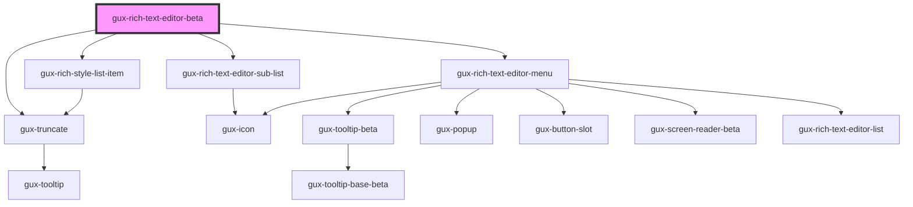

# gux-rich-text-editor-beta

<!-- Auto Generated Below -->

## Properties

| Property   | Attribute  | Description | Type      | Default |
| ---------- | ---------- | ----------- | --------- | ------- |
| `disabled` | `disabled` |             | `boolean` | `false` |

## Events

| Event             | Description | Type                  |
| ----------------- | ----------- | --------------------- |
| `guxToggleAction` |             | `CustomEvent<string>` |

## Slots

| Slot                       | Description                             |
| -------------------------- | --------------------------------------- |
| `"editor"`                 | Slot for the editor.                    |
| `"global-action"`          | Slot for global action.                 |
| `"inserting"`              | Slot for inserting actions.             |
| `"lists-indentation"`      | Slot for lists and indentation actions. |
| `"text-styling"`           | Slot for text-styling actions.          |
| `"typographical-emphasis"` | Slot for typographical actions.         |

## Dependencies

### Depends on

- [gux-rich-style-list-item](./gux-rich-text-editor-list/gux-rich-style-list-item)
- [gux-rich-text-editor-sub-list](./gux-rich-text-editor-list/gux-rich-text-editor-sub-list)
- [gux-truncate](../../stable/gux-truncate)
- [gux-rich-text-editor-menu](gux-rich-text-editor-menu)

### Graph

----------------------------------------------

*Built with [StencilJS](https://stenciljs.com/)*
